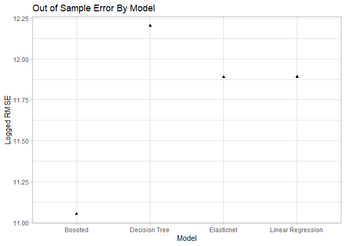
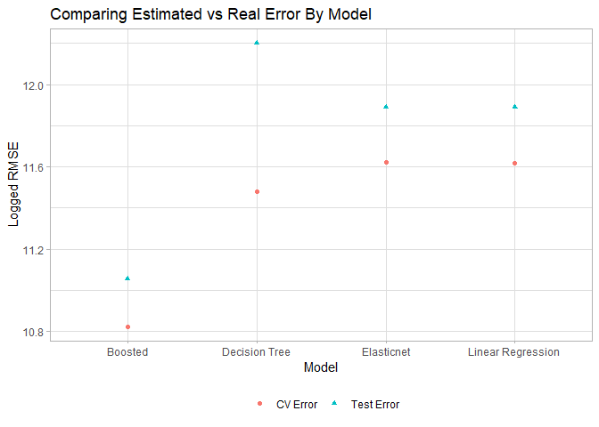

Predicting CO2 Emissions by Power Plant
================
Owen Jetton
3/10/2021

# Data

``` r
knitr::opts_chunk$set(echo = TRUE)
 
# Download and load packages
library(pacman)

p_load(readr, dplyr, ggplot2, readxl, magrittr, janitor, utils, tidyverse, tidymodels,
       tune, glmnet, recipes, rpart, xgboost)
```

``` r
# Read CO2 data from 2016 - 19
co2_data_2016 = read_xlsx("C:/Users/ojett/Documents/EC424/ec424project/emissions2016.xlsx",
                     sheet = 1) %>% mutate(year = 2016)
                        # add year variable which will be helpful for merging data later

co2_data_2017 = read_xlsx("C:/Users/ojett/Documents/EC424/ec424project/emissions2017.xlsx",
                     sheet = 1) %>% mutate(year = 2017)

co2_data_2018 = read_xlsx("C:/Users/ojett/Documents/EC424/ec424project/emissions2018.xlsx",
                     sheet = 1) %>% mutate(year = 2018)

co2_data_2019 = read_xlsx("C:/Users/ojett/Documents/EC424/ec424project/emissions2019.xlsx",
                     sheet = 1) %>% mutate(year = 2019)


# Upload heating days data
heat_df = read_xlsx("C:/Users/ojett/Documents/EC424/ec424project/state_region_heating_data.xlsx")
```

# Cleaning

``` r
# Binding CO2 to get larger data set
data_full = do.call("rbind", list(co2_data_2016, co2_data_2017,
                                  co2_data_2018, co2_data_2019))


# Cleaning the full CO2 data
data_full %<>% clean_names() %>%
  
    # only care about power plants that generate electricity
  filter(generation_k_wh > 0) %>% 
  
    # remove irrelevent or repretitive variables
  select(-c(eia_balancing_authority_region, balancing_authority_name, nerc_region, 
            fuel_units, metric_tonnes_of_co2_emissions, plant_name))


# Add heating data to main dataframe

data_full = merge(data_full, heat_df, by = c("state", "year"))


# Renaming CO2 emissions variable to "emissions"
  # I'm doing this because it is an important variable and will need to be written a lot
data_full %<>% rename(emissions = tons_of_co2_emissions) %>%
  
  # If there is no balancing authority
  mutate(balancing_authority_code = if_else(is.na(balancing_authority_code), "NONE",
                                            balancing_authority_code)) %>%
  
  # Also turn certain numerical variables into factors
  mutate_at(.vars = vars("sector_code", "balancing_authority_code", "state_code"),
            .funs = factor) 
```

``` r
# Graphs Checking out the data
ggplot(data_full, aes(x = log(generation_k_wh), y = log(emissions))) +
  geom_point(aes(color = aggregated_fuel_group)) +
  labs(x = "Generation (KWH)", y = "Tons of CO2 Emissions",
       title = "Power Generated Against CO2 Emissions by Fuel Group (Logged Values)",
      color = "Fuel Group",
      caption = "PET = Petroleum, MSW = Municipal solid waste, GEO = Geothermal, GAS = Natural Gas, COAL = Coal \nSource: U.S. Energy Information Agency") +
  theme_light()
```

<!-- -->

``` r
ggplot(data_full, aes(y = aggregated_fuel_group, fill = aggregated_fuel_group)) + 
  geom_bar(stat = "count") +
  labs(x = "Total", y = "Fuel Group",
       title = "Frequency of Fuel Groups in the Data",
       caption = "Source: U.S. Energy Information Agency") +
  theme_light() +
  theme(legend.position = "none")
```

<!-- -->

``` r
  # Note: Gas is ALL natural gas. MSW is Munincipal Solid Waste. PET is petroleum. 
          # Coal is mostly Bituminous Coal. PET is petroleum, mostly Distillate Fuel Oil
          # GEO is geothermal
  # full table explaining fuel codes here:
    # https://www.eia.gov/electricity/annual/html/epa_a_03.html
```

# Tuning and Training

### Split into Training and Testing Data

``` r
# Set seed before splitting
set.seed(231240)

# Initial 80/20 split for the training/testing data
data_split = data_full %>% initial_split(prop = 0.8)

  # Create training data
train_df = data_split %>% training()

  # Create testing data
test_df = data_split %>% testing()
```

### Create and Tune 4 models on Training data

``` r
# ------------------------------ Set up --------------------------------
# Creating Recipe used for multiple models below
train_recipe = train_df %>% recipe(emissions ~ .) %>%
          
                      # update role
                      update_role(plant_code, new_role = "id variable") %>%
  
                      # Add dummy variables for all nominal variables
                      step_dummy(all_nominal()) %>%

                      # Mean imputation for numeric predictors
                      step_meanimpute(all_predictors() & all_numeric()) %>% 
  
                      # normalize
                      step_normalize(all_predictors() & all_numeric()) %>%
                      
                      # Remove low-variance
                      step_nzv(all_predictors() & all_numeric()) %>%
  
                      # Remove highly correlated
                      step_corr(all_predictors() & all_numeric()) %>%
  
                      # Remove linearly dependent predictors
                      step_lincomb(all_predictors() & all_numeric()) 


# setting new seed for CV folds
set.seed(1387219452)

  # Create Cross Validcation folds
train_cv = train_df %>% vfold_cv(v = 5)
```

#### Linear Regression Model

``` r
# --------------------- Basic linear regression ----------------------

# Fitting the linear regression model to training data
reg_model = 
  linear_reg() %>%
  set_engine("lm")

# Create workflow
workflow_reg = workflow() %>%
  add_model(reg_model) %>%
  add_recipe(train_recipe)

# Train model on validation sets, set metric to root mean square error
cv_reg = workflow_reg %>% 
  fit_resamples(train_cv, metrics = metric_set(rmse))
```

    ## 
    ## Attaching package: 'rlang'

    ## The following objects are masked from 'package:purrr':
    ## 
    ##     %@%, as_function, flatten, flatten_chr, flatten_dbl, flatten_int,
    ##     flatten_lgl, flatten_raw, invoke, list_along, modify, prepend,
    ##     splice

    ## The following object is masked from 'package:magrittr':
    ## 
    ##     set_names

    ## 
    ## Attaching package: 'vctrs'

    ## The following object is masked from 'package:tibble':
    ## 
    ##     data_frame

    ## The following object is masked from 'package:dplyr':
    ## 
    ##     data_frame

``` r
# Finalize workflow to get our regression model!
final_reg = workflow_reg %>%
  finalize_workflow(select_best(cv_reg, 'rmse'))  %>%
  fit(data = train_df)
```

#### Elasticnet Model

``` r
# ------------------------ Elasticnet --------------------------------

# DEFINE ELASTICNET MODEL
en_model = linear_reg(penalty = tune(), mixture = tune()) %>% 
            set_engine("glmnet")

  # Define workflow
workflow_en = workflow() %>%
  add_model(en_model) %>%
  add_recipe(train_recipe) 

  # Define Penalties
lambdas = 10^seq(from = 5, to = -2, length = 1e2)
alphas = seq(from = 0, to = 1, by = 0.1)

  # Cross Validation Tuning with range of penalites and mixtures
cv_en = workflow_en %>%
  tune_grid(
    train_cv,
    grid = expand_grid(mixture = alphas, penalty = lambdas),
    metrics = metric_set(rmse)
  )

  # Finalize workflow for final model
final_en = workflow_en %>%
  finalize_workflow(select_best(cv_en, 'rmse'))  %>%
  fit(data = train_df)

# Wants penalty = 0.01, mixture = 0.3


# Graphing the performance of the models
ggplot() +
  geom_line(data = cv_en[[3]][[1]], 
            aes(x = mixture, y = log(.estimate), color = log(penalty))) +
    geom_point(data = cv_en[[3]][[1]] %>% filter(.config == "Preprocessor1_Model0301"), 
             aes(x = mixture, y = log(.estimate))) +
  geom_line(data = cv_en[[3]][[2]], 
            aes(x = mixture, y = log(.estimate), color = log(penalty))) +
    geom_point(data = cv_en[[3]][[2]] %>% filter(.config == "Preprocessor1_Model0301"), 
             aes(x = mixture, y = log(.estimate))) +
  geom_line(data = cv_en[[3]][[3]], 
            aes(x = mixture, y = log(.estimate), color = log(penalty))) +
    geom_point(data = cv_en[[3]][[3]] %>% filter(.config == "Preprocessor1_Model0301"), 
             aes(x = mixture, y = log(.estimate))) +
  geom_line(data = cv_en[[3]][[4]], 
            aes(x = mixture, y = log(.estimate), color = log(penalty))) +
    geom_point(data = cv_en[[3]][[4]] %>% filter(.config == "Preprocessor1_Model0301"), 
             aes(x = mixture, y = log(.estimate))) +
  geom_line(data = cv_en[[3]][[5]], 
            aes(x = mixture, y = log(.estimate), color = log(penalty))) +
      geom_point(data = cv_en[[3]][[5]] %>% filter(.config == "Preprocessor1_Model0301"), 
             aes(x = mixture, y = log(.estimate))) +
  labs(title = "Performance of Elasticnet Models on CV Folds",
       x = "Mixture", y = "Logged RMSE",
       color = "Logged Penalty", 
       caption = "Dots represent best model, where Mixture = 0.3, Penalty = 0.01")
```

<!-- -->

#### Decision Tree Model

``` r
# ---------------------------- Decision Tree ------------------------------

# Creating regression tree
tree_model = decision_tree(
  mode = "regression",
  cost_complexity = tune(),
  tree_depth = tune(),
  min_n = 5
) %>% set_engine("rpart")

# Define workflow
workflow_tree = workflow() %>%
  add_model(tree_model) %>%
  add_recipe(train_recipe)

# Tune with metrics root mean square error and r-squared
tree_cv_fit = workflow_tree %>%
  tune_grid(
    train_cv,
    grid = expand_grid(
      cost_complexity = seq(0, 10, by = 0.5),
      tree_depth = seq(1, 10, by = 1)
    ),
    metrics = metric_set(rmse)
  )

# finalize workflow for plotting and predicting
best_flow = workflow_tree %>%
  finalize_workflow(select_best(tree_cv_fit, 
                                metric =  "rmse")) %>%
  fit(data = train_df)

# Extract fitted model

best_tree = best_flow %>% pull_workflow_fit()


# Graphing Performances of the models on CV folds
ggplot() +
  geom_line(data = tree_cv_fit[[3]][[1]], 
            aes(x = tree_depth, y = log(.estimate), color = cost_complexity)) +
    geom_point(data = tree_cv_fit[[3]][[1]] %>% 
                 filter(.config == "Preprocessor1_Model010"), 
             aes(x = tree_depth, y = log(.estimate))) +
 geom_line(data = tree_cv_fit[[3]][[2]], 
            aes(x = tree_depth, y = log(.estimate), color = cost_complexity)) +
    geom_point(data = tree_cv_fit[[3]][[2]] %>% 
                 filter(.config == "Preprocessor1_Model010"), 
             aes(x = tree_depth, y = log(.estimate))) +
 geom_line(data = tree_cv_fit[[3]][[3]], 
            aes(x = tree_depth, y = log(.estimate), color = cost_complexity)) +
    geom_point(data = tree_cv_fit[[3]][[3]] %>% 
                 filter(.config == "Preprocessor1_Model010"), 
             aes(x = tree_depth, y = log(.estimate))) +
 geom_line(data = tree_cv_fit[[3]][[4]], 
            aes(x = tree_depth, y = log(.estimate), color = cost_complexity)) +
    geom_point(data = tree_cv_fit[[3]][[4]] %>% 
                 filter(.config == "Preprocessor1_Model010"), 
             aes(x = tree_depth, y = log(.estimate))) +
 geom_line(data = tree_cv_fit[[3]][[5]], 
            aes(x = tree_depth, y = log(.estimate), color = cost_complexity)) +
    geom_point(data = tree_cv_fit[[3]][[5]] %>% 
                 filter(.config == "Preprocessor1_Model010"), 
             aes(x = tree_depth, y = log(.estimate))) +
  labs(title = "Performance of Decision Tree Models on CV Folds",
       x = "Tree Depth", y = "Logged RMSE",
       color = "Cost Complexity", 
       caption = "Dots represent best model, where Cost Complexity = 0, Tree Depth = 10")
```

<!-- -->

#### Boosted Ensemble model

``` r
# ------------------------------ Boosting --------------------------------

# Creating the model - regression tree boosted emsemble model
boost_model = boost_tree(
  mtry = NULL,
  trees = 100,
  min_n = NULL,
  tree_depth = tune(),
  learn_rate = tune()
  ) %>% 
  set_engine("xgboost") %>%
  set_mode("regression")


# define workflow
workflow_boost = workflow() %>%
  add_model(boost_model) %>%
  add_recipe(train_recipe)

# Run the model
    # I used 5:5 for levels, due to my weak computer. I recommend trying higher.
cv_boost = workflow_boost %>%
  tune_grid(
    train_cv,
    grid = grid_regular(tree_depth(),
                        learn_rate(),
                        levels = 5:5),
    metrics = metric_set(rmse)
    )

# Finalize workflow and fit to training data
final_boost = workflow_boost %>%
  finalize_workflow(select_best(cv_boost, "rmse")) %>% 
  fit(data = train_df)

# Likes Learn Rate 0.1, Tree Depth of 11

# Graphing Boosted Models' performance
ggplot() +
  # first fold
  geom_line(data = cv_boost[[3]][[1]], 
            aes(x = tree_depth, y = log(.estimate), color = learn_rate)) +
    geom_point(data = cv_boost[[3]][[1]] %>% 
                 filter(.config == "Preprocessor1_Model24"), 
             aes(x = tree_depth, y = log(.estimate))) +
  # second fold
  geom_line(data = cv_boost[[3]][[2]], 
            aes(x = tree_depth, y = log(.estimate), color = learn_rate)) +
    geom_point(data = cv_boost[[3]][[2]] %>% 
                 filter(.config == "Preprocessor1_Model24"), 
             aes(x = tree_depth, y = log(.estimate))) +
  # third fold
  geom_line(data = cv_boost[[3]][[3]], 
            aes(x = tree_depth, y = log(.estimate), color = learn_rate)) +
    geom_point(data = cv_boost[[3]][[3]] %>% 
                 filter(.config == "Preprocessor1_Model24"), 
             aes(x = tree_depth, y = log(.estimate))) +
  # fourth fold
  geom_line(data = cv_boost[[3]][[4]], 
            aes(x = tree_depth, y = log(.estimate), color = learn_rate)) +
    geom_point(data = cv_boost[[3]][[4]] %>% 
                 filter(.config == "Preprocessor1_Model24"), 
             aes(x = tree_depth, y = log(.estimate))) +
  # fifth fold
  geom_line(data = cv_boost[[3]][[5]], 
            aes(x = tree_depth, y = log(.estimate), color = learn_rate)) +
    geom_point(data = cv_boost[[3]][[5]] %>% 
                 filter(.config == "Preprocessor1_Model24"), 
             aes(x = tree_depth, y = log(.estimate))) +
  # Adding labels
  labs(title = "Performance of Boosted Ensemble Models on CV Folds",
       x = "Tree Depth", y = "Logged RMSE",
       color = "Learn Rate", 
       caption = "Dots represent best model, where Learn Rate = 0.1, Tree Depth = 11")
```

<!-- -->

### Estimate CV Error

``` r
#  Estimate your error (with an appropriately chosen metric) using cross validation

# Linear Regression Root Mean Square Error
    # Averaging the CV RMSE errors from tuning
reg_error = sum(cv_reg[[3]][[1]]$.estimate + cv_reg[[3]][[2]]$.estimate +
                   cv_reg[[3]][[3]]$.estimate + cv_reg[[3]][[4]]$.estimate +
                   cv_reg[[3]][[5]]$.estimate)/5


# Elasticnet Root Mean Square Error
    # values extracted manually through cv_en dataset estimates where
    # penalty = 0.01, and mixture = 0.3
elas_error = sum(124364.5 + 123987.1 + 119266.0 + 67416.86 + 123229.3)/5


# Decision Tree Root Mean Square Error
    # values extracted from tree_cv_fit dataset with correct hyperparameters
    # cost complexity = 0, tree depth = 10
tree_error = sum(130349.0 + 92505.39 + 55999.62 + 67723.97 +
                   136221.0)/5


# Boosted Model Root Mean Square Error
    # values extracted manually from the cv_boost dataset with correct tree
    # depth (11) and learn rate (0.1) that the final boosted model has
boost_error = sum(86096.08 + 40215.92 + 38403.37 + 43542.27 + 42643.87)/5


# Comparing Cross Validation Errors
cv_error_df = data.frame(Model = c("Linear Regression", "Elasticnet",
                                   "Decision Tree", "Boosted"),
                         Error = c(reg_error, elas_error, tree_error,
                                      boost_error))

ggplot(cv_error_df, aes(x = Model, y = log(Error))) +
  geom_point() +
  labs(x = "Model", y = "Logged CV RMSE",
       title = "Estimated Cross Validation Error By Model") +
  theme_light()
```

<!-- -->

# Prediction

### Test on test data

``` r
# Predicting with Linear Regression
reg_pred = final_reg %>% predict(new_data = test_df)

# Predicting with Elasticnet
en_pred = final_en %>% predict(new_data = test_df)

# Predicting with Decision Tree
tree_pred = best_flow %>% predict(new_data = test_df)

# Predicting with Boosted Model - WORKED
boost_pred = final_boost %>% predict(new_data = test_df)


# Gathering the RMSE's of the predictions into a dataframe. '
    # "rmse" function from Metrics package, but not until now b/c of conflict with
    # yardstick package
p_load(Metrics)

predict_rmse_df = data.frame(
  Model = c("Linear Regression", "Elasticnet", "Decision Tree", "Boosted"),
  Error = c(rmse(test_df$emissions, reg_pred$.pred),
           rmse(test_df$emissions, en_pred$.pred),
           rmse(test_df$emissions, tree_pred$.pred),
           rmse(test_df$emissions, boost_pred$.pred))
  )


# Plotting the RMSE of the predictions
ggplot(predict_rmse_df, aes(x = Model, y = log(Error))) +
  geom_point(shape = 17) +
  labs(x = "Model", y = "Logged RMSE",
       title = "Out of Sample Error By Model") +
  theme_light()
```

<!-- -->

``` r
# Putting the RMSE datasets together to compare
compare_df = rbind(cv_error_df, predict_rmse_df)

  # adding designation variable for graphing ease
compare_df %<>% mutate(Type = c("CV Error", "CV Error", "CV Error", "CV Error",
                                "Test Error", "Test Error", "Test Error", "Test Error"))


# Graphing a comparison
ggplot(compare_df, aes(x = Model, y = log(Error), shape = Type, color = Type)) +
  geom_point() +
  labs(x = "Model", y = "Logged RMSE",
       title = "Comparing Estimated vs Real Error By Model") +
  theme_light() +
  theme(legend.position = "bottom", legend.title = element_blank())
```

<!-- -->

### Turn in:

1.  Link to this github page with (commented) analysis code and figures
2.  1-page “executive summary”
3.  4-slide summary following paragraphs 2–5 of the executive summary
4.  Evaluation of your group member’s contribution (doesn’t apply)

### Sources

  - Emissions by power plant for CO2, SO2, and NOx (2019)
    <https://www.eia.gov/electricity/data/emissions/>
  - Guide to data
    <https://www.eia.gov/electricity/data/guide/pdf/guide.pdf>
  - Cooling and heating days data
    <https://www.ncdc.noaa.gov/societal-impacts/redti/time-series/USA/dec/year-to-date>
